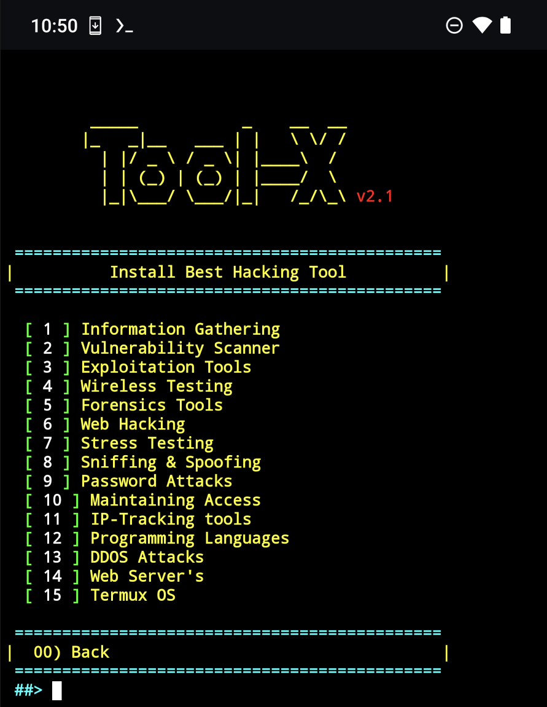

# Tool-X

### Beschreibung

*Tool-X ist ein Hacking-Tools-Installer für Kali Linux für Termux und Linux-Systeme.*
Tool-X wurde für Termux und andere Android-Terminals entwickelt, damit du mehr als 370 Hack-Tools auf Termux (Android) und anderen Linux-basierten Distributionen installieren kannst. Tool-X ist auch für Ubuntu, Debian usw. verfügbar.

 

------------------------------------------------------------------------

### Betriebssystemanforderungen

Tool-X funktioniert auf einem der folgenden Betriebssysteme: 
• **Android** (unter Verwendung der Termux-App)  
• **Linux** (Debian-basierte Systeme)  
• **Unix**

------------------------------------------------------------------------

### Installation

Öffne das Terminal und gib die folgenden Befehle ein.

* `apt update`

* `apt install git`

* `git clone https://github.com/bjoernfranck/Tool-X.git`

* `cd Tool-X`

* `chmod +x install`

* `sh ./install`

------------------------------------------------------------------------

### Wie wird es verwendet?

Gib eine Nummer für eine spezifische Ausgabe ein:
- (1): Zeige alle verfügbaren Tools und gib die Nummer eines Tools ein, das du installieren möchtest.
- (2): Zeige Tools-Kategorien.
- (3): Wenn du Tool-X aktualisieren möchtest.
- (4): Wenn du über uns erfahren möchtest.
- (x): Zum Beenden des Tools.

 

***Tool-X wurde erfolgreich installiert. Um Tool-X auszuführen, gib `Tool-X` oder `toolx` in deinem Terminal ein.***

Gib `Tool-X` oder `toolx`  von überall in deinem Terminal ein, um Tool-X zu öffnen.

------------------------------------------------------------------------

**Haftungsausschluss**

Ich möchte darauf hinweisen, dass das Hacken von Computersystemen ohne Zustimmung des Eigentümers illegal und moralisch fragwürdig ist. Hacking-Inhalte und -Tools sollten ausschließlich für legitime Zwecke wie Penetrationstests zur Verbesserung der Cybersicherheit oder zu Schulungszwecken verwendet werden.

Bitt beachte, dass das Herunterladen und Verwenden von Hacking-Inhalten und -Tools auf eigenes Risiko geschieht. Ich übernehme keine Haftung für Schäden oder rechtliche Konsequenzen, die durch die Nutzung dieser Inhalte entstehen können.

Ich möchte betonen, dass es wichtig ist, sich über die geltenden Gesetze und Bestimmungen in Ihrem Land oder Ihrer Region zu informieren und nur mit ausdrücklicher Zustimmung des Eigentümers eines Computersystems auf Hacking-Inhalte und -Tools zuzugreifen.
### Ich verwende zum Hacken ausschließlich meine eigene Hardware oder habe eine schriftliche Erlaubnis. ###
### Jegliche illegale Verwendung meiner Materialien wird von mir nicht toleriert oder unterstützt. ###

